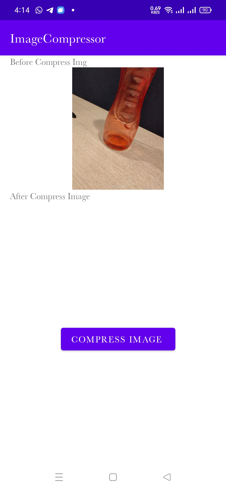
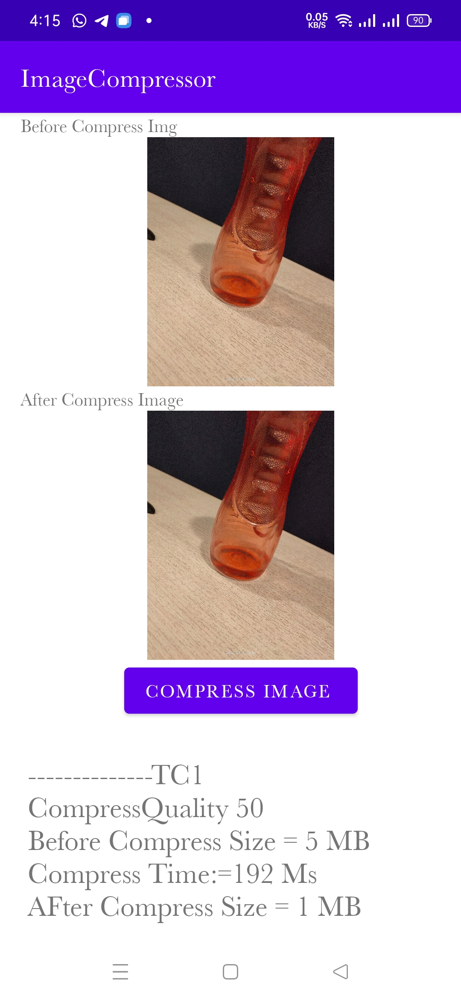

# Android Compress Image 
This is a sample app  that uses kotlin BitmapCompress Operation to compress an image taken from default camera 
## Screenshot

Select Img|Before Compress|After Compress
:--:|:--:|:--:|
||

Whole App Preview Gif

Help Full Links

* [Compress Logic](https://stackoverflow.com/questions/8417034/how-to-make-bitmap-compress-without-change-the-bitmap-size)
* [Capture Image From Camera](https://developer.android.com/training/camerax/take-photo)
* [Zoom Pain Image View Libarary ](https://github.com/Baseflow/PhotoView)