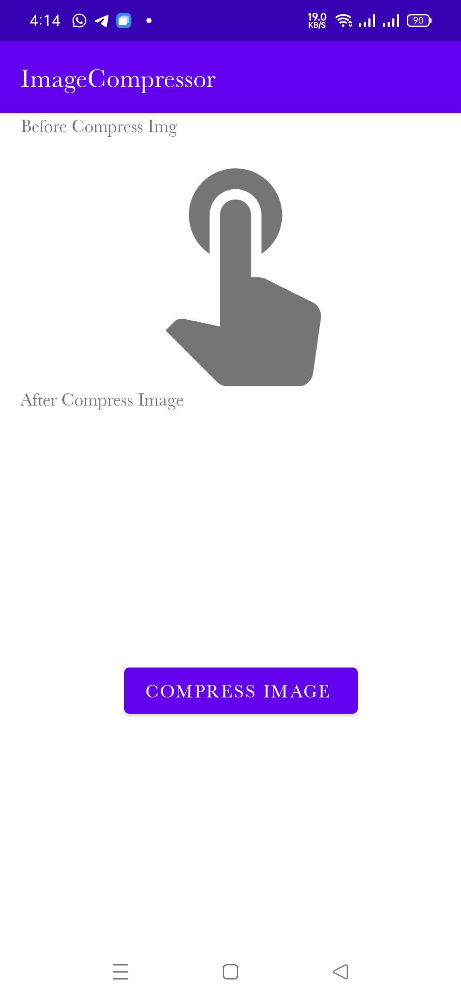

# Android Compress Image 
This is a sample app  that uses kotlin BitmapCompress Operation to compress an image taken from default camera 
## Screenshot

Select Img|Before Compress|After Compress
:--:|:--:|:--:|
||